# 🦢 Guia Passo a Passo para Dobrar um Tsuru de Origami 🎴

## 📄 Materiais Necessários
- Folha de papel quadrada (15cm × 15cm)
- Superfície plana para dobrar
- Paciência e cuidado ✨

---

## 🔷 Passo 1: Preparando o Papel
✂️ Corte uma folha em formato quadrado perfeito de **15cm × 15cm**  

---

## 🔶 Passo 2: Primeiras Dobras
1. Posicione o quadrado como um losango (ponta para baixo)  
2. Dobre nas duas diagonais para marcar um **"X"** central  
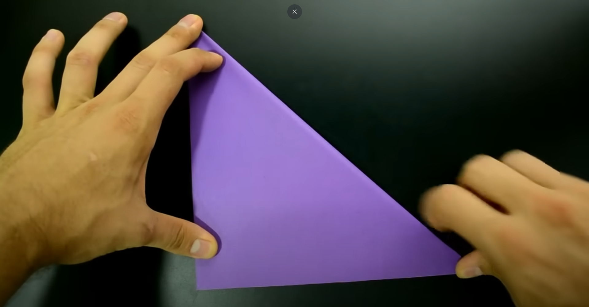  
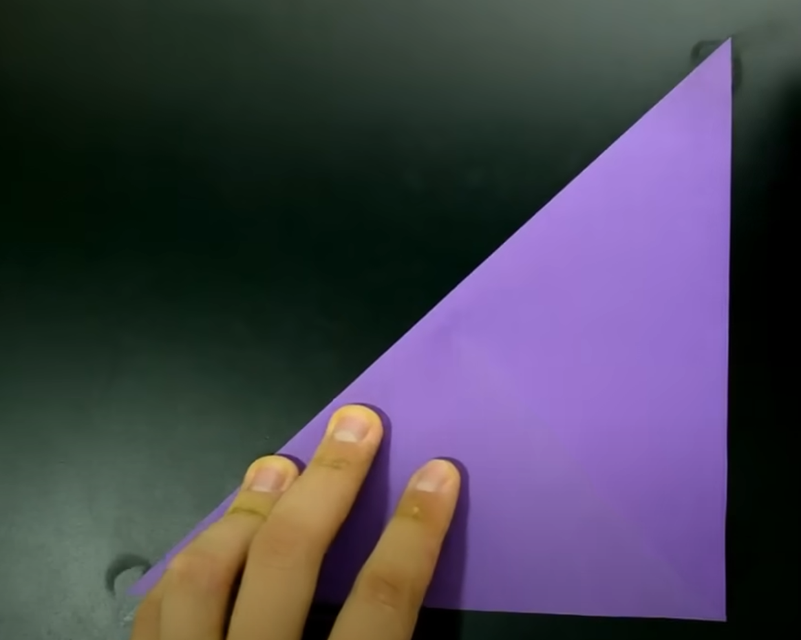  

---

## 🔷 Passo 3: Criando a Base
↩️ Vire o papel e:
- Dobre na horizontal e vertical (formando uma **+**)  
↩️ Vire novamente e:
- Empurre todas as pontas para o centro  
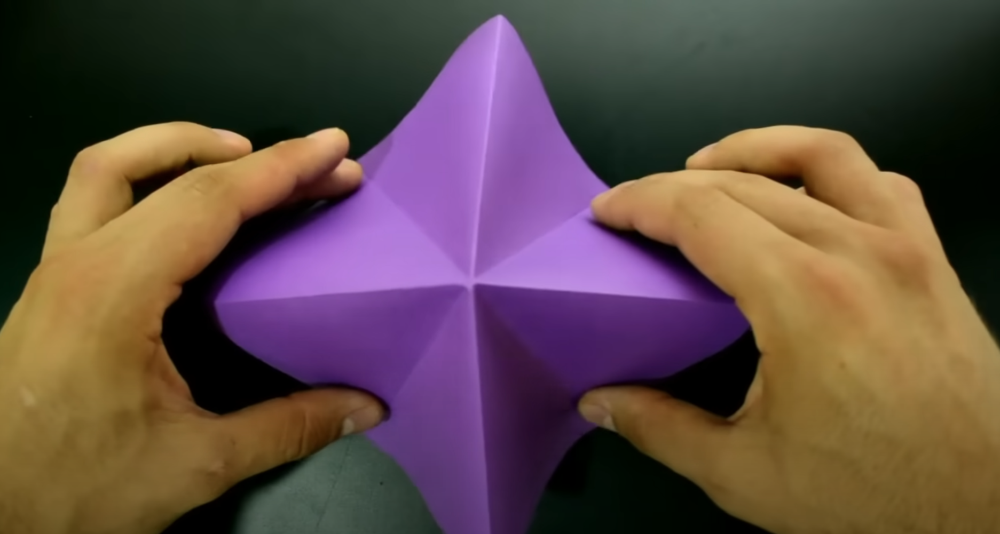  
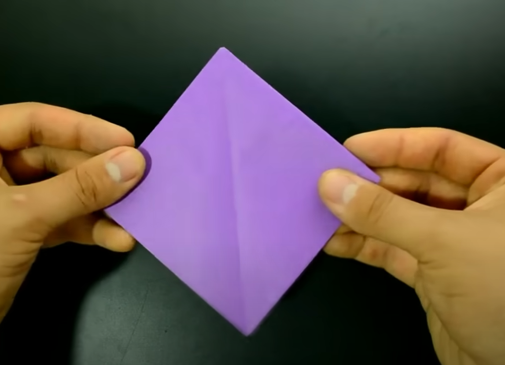  

💡 **Dica:** Aperte bem as dobras com a unha para ficarem marcadas!

---

## 🔶 Passo 4: Formando as Abas
1. Dobre a ponta inferior direita ao centro  
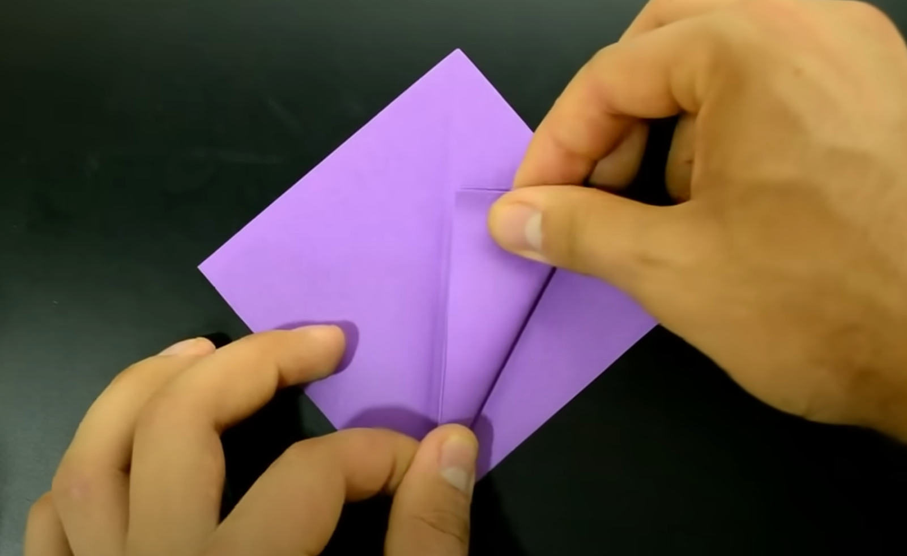  
2. Repita com a esquerda  
3. Desdobre ambas  
4. Levante a camada inferior  
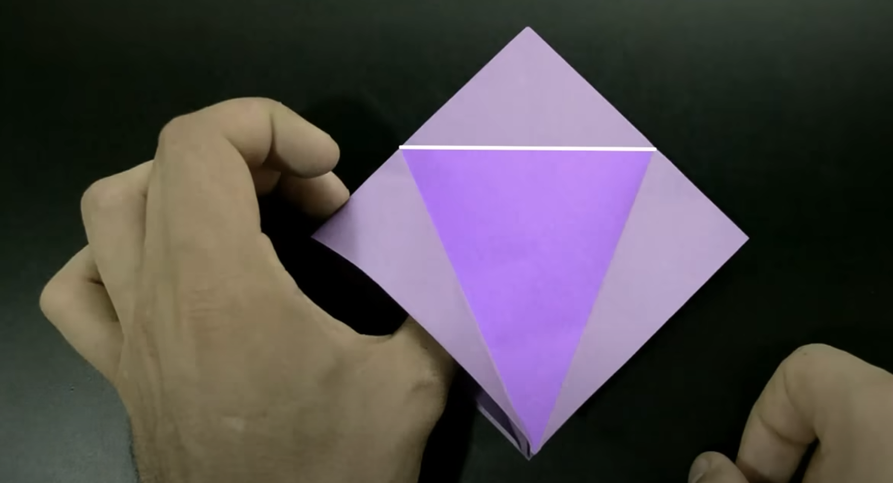  

🔁 **Importante:** Vire e repita todo o processo no verso!  
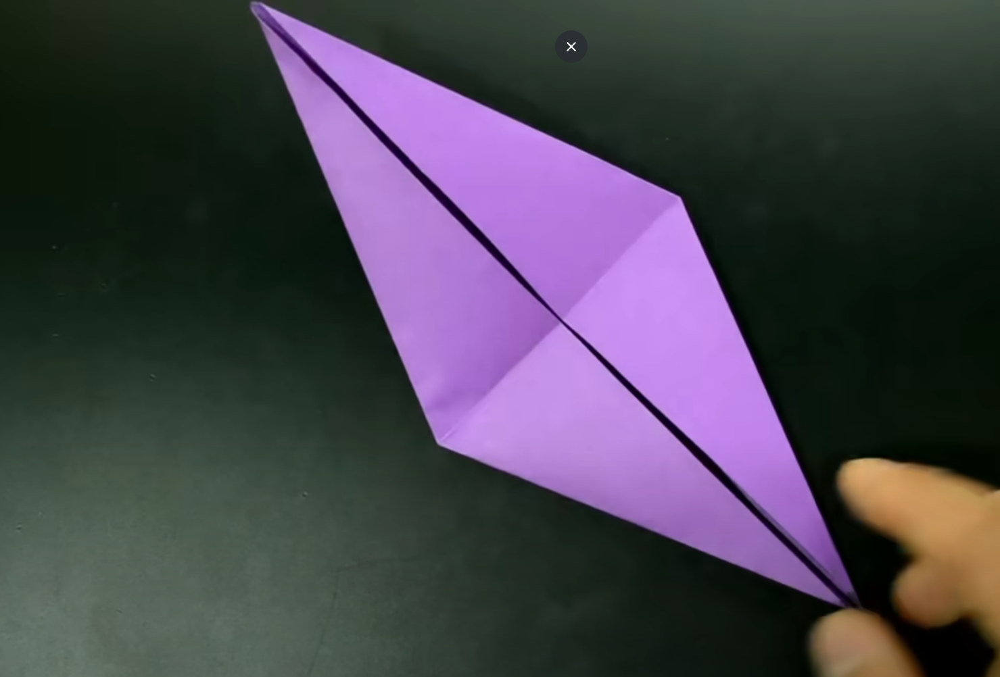  

---

## ✨ Passo 5: Moldando o Tsuru
1. Dobre as laterais para o centro  
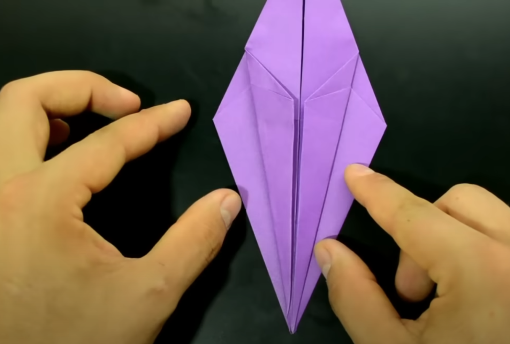  
2. Abra cuidadosamente as pontas finas  
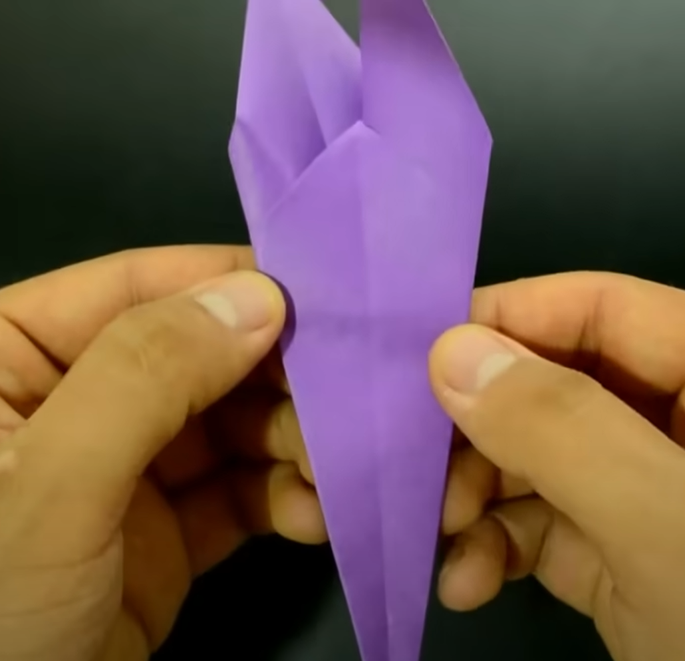  
3. Dobre para cima criando as asas  
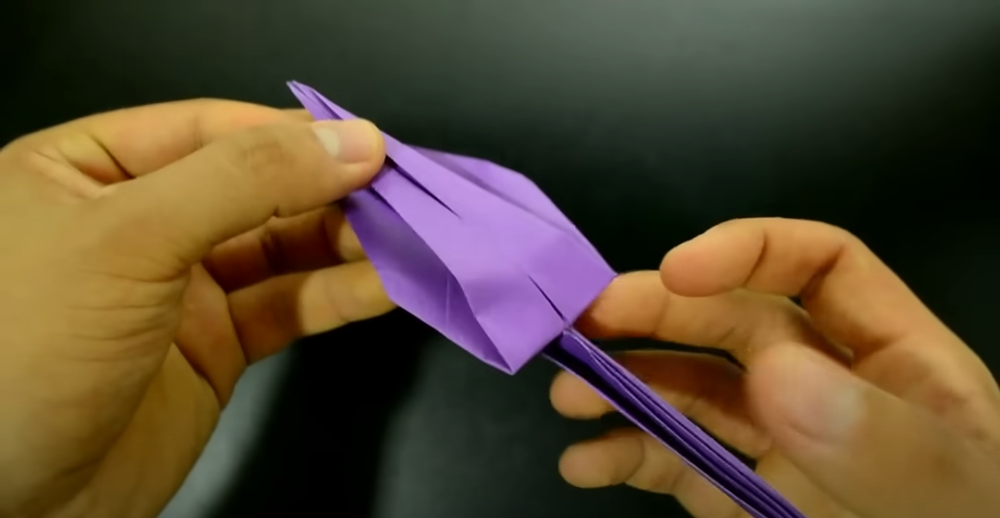  

---

## 🎉 Finalização
🦅 Dobre uma ponta para frente formando a cabeça:  
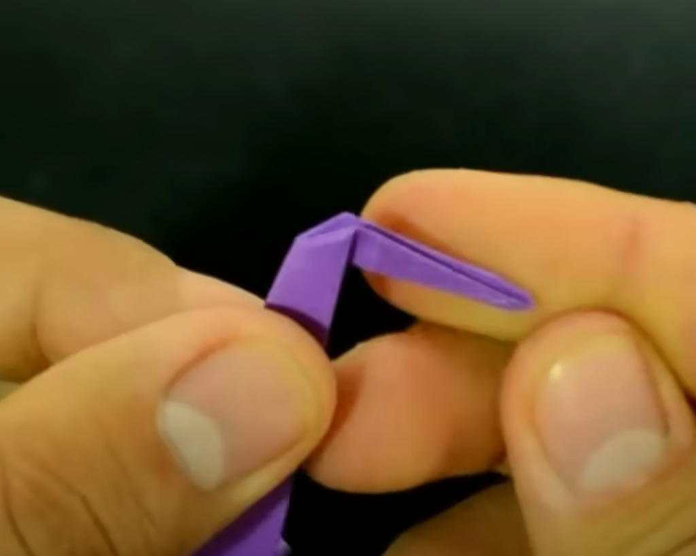  

✨ **Seu lindo tsuru está pronto!** ✨  
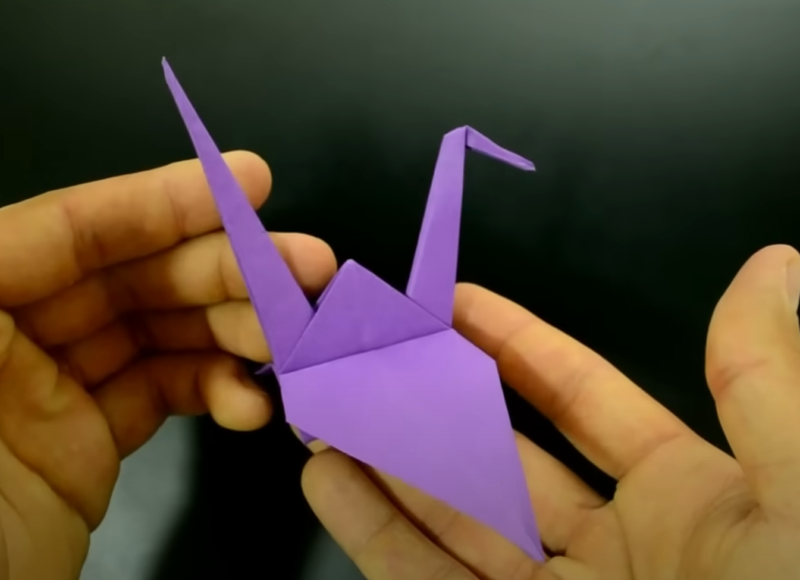  

💬 Dica extra: Faça vários de cores diferentes para decorar!